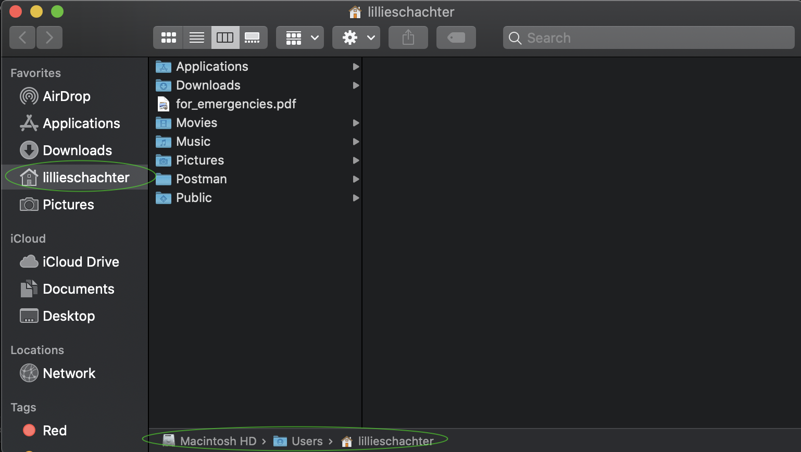

# Before class

* Install the text editor [VSCode](https://code.visualstudio.com/)

# Outline of class agenda

By the end of this class, you'll:
* Feel comfortable navigating your computer's file structure
* Understand how to work with the command line
* Know what a working directory is, and how to identify your *current working directory*
* Be able to change working directories from the command line
* Be able to find files you are working on from the command line in the file browser (finder) and vice versa

# Class

## 1. Exploring your Files

Most computers come with a built in way to interact with your files and applications. On Macs, this is called the Finder. On Windows and other PCs, it can be called the Windows Explorer or File Explorer. Open up your computer's version of this now and take a look.


You can think of everything you see here as folders. Folders can hold files, applications, more folders, etc. You might see an `Applications` Folder that holds all of your applications. A `Downloads` Folder holds any files you download from the internet. A `Documents` or `My Documents` Folder will hold all of your documents.

To get familiar with the Finder/File Explorer, navigate to your `Documents` or `My Documents` folder and create a new folder inside of it called `JTC-Test`. If you're not sure how, try clicking around the menu, or even feel free to Google it.

## 2. The command line

The "command line" is another way to interact with your computer just like the Finder/File Explorer. The difference is that instead of giving your computer instructions by clicking buttons or dragging and dropping, you'll now be _typing_ your instructions (aka 'commands'). This will give us a lot more flexibility and power over our computers in the long run. We're going to do the exact same thing that we just did in the Finder/File Explorer, but this time, using the command line.

If you're using a Mac, you can open the `Terminal` to get to your command line prompt. If you're using a PC, open the `Command Prompt`.

When you open your command line prompt, you should either see a `$` symbol or `>` symbol at the end of the line.


This is the **'prompt'**, indicating that it is ready for you to input a command. It will look a bit like this, but a bit different based on your username on your computer.

## 3. Breaking down the task

The steps we took to create a folder in the Finder/File Explorer may have felt intuitive, but let's break them down into clear pieces so we can replicate them on the command line. Once we had the finder open, what's the first thing we did?

Our steps could be written out like this:

a) Figure out where we are in the file structure.

b) Figure out where the `Documents` folder is.

c) Navigate to the `Documents` folder.

d) Create/name new folder

Let's see how these steps translate to the command line.

## 4. Paths

#### How to run things from the command line?
  * You pretty much always interact with the command line by typing a 1 line command. Then you run it by hitting enter!
  * Depending on which command line you're using (Terminal, Command Prompt, etc), the commands you use will be different.

##### NOTE:
When someone built the `Terminal`, they decided what to name each command. Someone else built the `Command Prompt`, and chose different names for the same instructions. That's why these instructions are different depending on your computer. Either way, when you tell your computer to do something in the command line, you're using *code*!

### a) Figure out where we are in the file structure

Terminal | File Explorer | Description
-------- | ------------- | -----------
pwd | chdir | Returns your current directory location

In the visual Finder/File Explorer, we can see where we are because the current folder is highlighted. Depending on your settings, you might also see the **path** through folders that your computer took to get there (bottom of the picture).



To figure out where we are in the file structure from the command line, we need to "print our working directory". ???

**Essentially, the "working directory" is the folder that you are currently 'in'.** In fact, the word 'directory' is the word that the command line uses when it's talking about 'folders'. For the purposes of this class, they mean the exact same thing.

To check your working directory from the command line, type the given command for your computer, either `pwd` (print working directory) or `chdir`, respectively.


Here, I can now see that I'm in the folder `/Users/paul`

This is what's called a **path**. A folder's path (or file's path, etc), tells you not just what folder it's in, but what folder THAT folder's in, etc etc until it gets all the way to the biggest folder that holds all the other folders. This one is called the **root** folder, because all other folders come from it. The slashes (`/`) separate each folder's name in the path. So `paul` is a folder inside the `Users` folder.

* NOTE: These slashes might go the other direction (`\`) depending on your operating system, but they work the same way

You can verify for yourself how this works by looking at your folders in the Finder/File Explorer. Here in my finder we can see that the `paul` folder is inside the `Users` folder


So we know where we are. Now we need to find our Documents folder.

## 5. Listing files / folders

Terminal | File Explorer | Description
-------- | ------------- | -----------
ls | dir | Directory listing

### b) Figure out where the `Documents` folder is.

In the Finder/File Explorer, it automatically shows you what's inside your current folder. To see what files and folders are in your **working directory** from the command line, you need to tell the computer to list out the files and folders in your working directory. Use your respective computer's command, either `ls` or `dir`.


Again, this is equivalent to opening up the same folder in your finder/file explorer and looking around. For example, if I go in finder to this folder, it has the same contents, just displayed a little differently:


#### An additional flag

One of the reasons that the command line is so much more powerful than the Finder/File Explorer is because you can use what's called a ['flag'](https://en.wikipedia.org/wiki/Command-line_interface#Command-line_option) to modify the output of a command you run at the prompt. With `ls`, we can add a `-l` flag to get more detailed info on each folder/file in the working directory (like the file size, when it was created or last updated, etc) as below:


```console
$ ls -l
```

The output looks like this:


We won't go into the details of what each output is now, but this more detailed printout can help us find a lot of information about our files and folders. If you'd like to know more about this output, [check out this link.](https://linoxide.com/linux-command/20-ls-command-linux/)

## 6. Changing working directory

Terminal | File Explorer | Description
-------- | ------------- | -----------
cd | cd | Change the current directory

### c) Navigate to the `Documents` folder.

Now that we know where our `Documents` folder _is_, we need to go to it! In the Finder/File Explorer, we do this simply by clicking on it. In the command line, moving to a different folder is called "**changing directories**". The command for this is actually the same no matter what computer you're using-- `cd` for 'change directory'.

This command works a little differently than the others we've used so far-- we're telling the computer that we need to change our directory, but which one do we want to go *to*? We need to tell the computer that too.

To change directories in the command line, you type `cd <directory-name>`. So in this case, that would be `cd Documents`.

**NOTE:** As magical as it may sometimes seem, the computer can only do exactly what you tell it to. If the folder name is misspelled, or missing a Capital letter etc, the computer will not know what you're talking about. That's ok! You won't break your computer. You can just try again.


We actually get **no printout** here, it just returns us to the next command prompt. So, we can check whether we actually made it into the folder we wanted to by running `pwd`/`chdir` again to show the working directory. It should now say `/Users/Paul/Documents`.

So, we can see that we are actually in the Documents folder. If we run `ls`, we will now see the contents of this folder instead, and we can confirm this in Finder/File Explorer:


We can see the same things in the `Documents` directory whether we look in Finder (left) or via the command line (right).

## 7. Create new directory

Terminal | File Explorer | Description
-------- | ------------- | -----------
mkdir | md | To create a new directory/folder

### d) Create/name new folder

We made it! Now that we're in the right place, we can finally make our new folder for this class. This command works the same way that `cd` does-- we need to tell the computer not just which command we're using, but also the name of folder we're talking about. In this case, what we want to _name_ our new folder. `mkdir <new-directory-name>`. This will be the real folder we use for the class, so let's name it accordingly. Based on your computer, create a new folder by either typing `mkdir JTC` or `md JTC`.

Make sure to check your Finder/File Explorer, and you should see your new folder there too!

## 8. VSCode Terminal

You now know how to use a core tool to control your computer like a programmer. There are [many other commands](https://www.geeksforgeeks.org/linux-vs-windows-commands/) you can use, a couple of which you'll see in the challenge tonight. But they're always a google away, so no sweat if you don't remember them!

We'll discuss your `code editor`, `VSCode`, more later, but for now, open it up.

It comes with a built in version of `Terminal` that runs even on Windows machines.


To keep the class on the same page from now on, non-Mac users should use this Terminal instead of the Command Prompt. It's good to know both! But for the purposes of the class, it's easier to keep track if we're all using the same commands.
