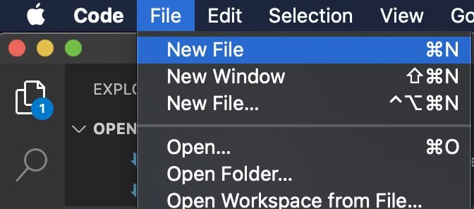

# Outline of lesson

* Write your first python code!

# Python

It is a rite of passage that the first line of code a new programmer writes does one thing: prints out 'Hello, world!'. Because the robots definitely aren't going to take over and your computer talking to you isn't scary at all, right? Let's get to it.

Python 3 (new versions are released periodically) should already be installed on your computer from the Pre-course installation instructions, but let's check again just in case.

Open the Terminal and type `python3 --version` to check. If it displays 'Python' and a version number, you're all set!

In some ways, Python works a lot like any other language you learn-- there's vocabulary (keywords) and grammar (syntax) that you have to keep in mind if you want your writing to make sense. Thankfully 'code editors' like `VSCode` help make that a lot simpler. Once you tell the computer what language your file is written in, `VSCode` knows how to apply that language's rules to what you write. So let's tell the computer that we're going to be writing a python file. We do that with how name our file.

You've already seen `.txt` files in today's challenge, like `JFK.txt` and `LGA.txt`. `txt` stands for 'text', since these were 'text files'. Similarly, jpeg pictures use the `.jpeg` 'extension' to tell the computer that the file is a photo.

To tell the computer that a file has python code in it, we use the `.py` extension. Let's create a new file called `hello_world.py`. There are a few different ways to do this, but for now, you can use the top menu to open a new file.

Using the same menu, click 'save' to save the file. (Where do you want this file to live on your computer? For now, let's put it in the `JTC` folder you created in class earlier. You can move it later using your Finder/File Explorer or even the command line.)

In your file, type

`print('Hello, world!')`

Note, did the word 'print' change color? That's because it's a Python key word, which means when you use it in Python code, it _does_ something. Let's see what!

Save the file again. Now open up your terminal, either in `VScode` or otherwise, if you're on a Mac. Navigate to the folder that `hello_world.py` is saved in (hint: use `cd` to change directories, and `ls` to see what's in your working directory to see if you're in the right place).

Type `python3 hello_world.py` in your terminal.

Congratulations, you're a programmer!
