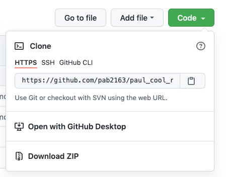
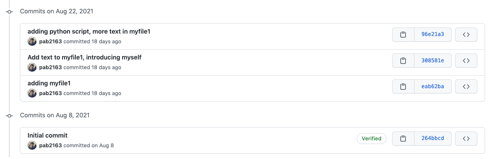
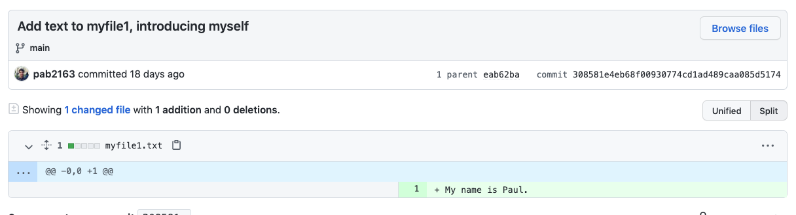

# Make your own git repo challenge!

In this challenge, you will: 

* Create a GitHub repository
* Clone this repository to your local computer
* Customize your README
* Push your changes to GitHub
* Check out your commit history on Github

## Step 0: Customizing Git

### *** If you have already connected your GitHub account to your computer and set up your git config file, you can skip this step. ***

To connect your GitHub account, run the commands:
```
$ git config --global user.name "your_username"

$ git config --global user.email "your_email@columbia.edu"

$ git config --global core.editor "code --wait"
```

## Step 1: Creating the repository

Go to the [GitHub](https://github.com/). In the top right, you will see a plus sign. Click on the plus sign and then click **New Repository**. Name this repository `02_git_test_repo`. Leave the privacy setting as public. Check the box that says **Add a README file**. When you're done, click the button that says **Create Repository**. 

## Step 2: Cloning the repository

On the GitHub page for your newly created repository, there is a green button labeled **Code**. Click this button, and then click on the word **HTTPS** so that it is underlined in orange. Next, click on the clipboard icon next to the URL to copy the URL. 




Next, on the command line, navigate to a directory that is *not* already a GitHub repository. We recommend somewhere easy to find, like your `Documents` or `Desktop` folder, but make sure you choose this deliberately! You can verify that this folder is NOT already a github repo this by running:
```
$ git status
```
and making sure the response is something like `fatal: not a git repository`.  If you do NOT get this response, it means you are in an existing git repository. **You should NOT create one git repository inside another**, so if this is the case, move out of the folder you're in using:

```
$ cd ..
```

Then, navigate to a new location. Then, as you just did, check the status again with `git status` to make sure you're not in a repository. Keep doing this until you're not in a repository.

Now, Clone your GitHub repository into this folder:

```
$ git clone https://github.com/{your_username}/02_git_test_repo.git
```
Now, when you list all the files, you'll see a new folder called `02_git_test_repo`.

## Step 3: Customizing your README

Move into this folder:
```
$ cd 02_git_test_repo
```
List the files again and see that there is a README.md file. README files tell users what the purpose of a repository is, and pretty much every repository you'll see will have a README file. The '.md' file ending designates it as a Markdown file. Markdown allows you to easily customize the appearance of your text files with just a few shortcuts. This document is also written in Markdown!

To customize your README, open up this file in VS Code, and write whatever you would like. For now, you don't need to worry about formatting the Markdown in special ways, but you can find tips and tricks for using Markdown [here](https://www.markdownguide.org/cheat-sheet/). Make sure to save any changes you make to this file!

## Step 4: Pushing your changes to the repository

After you have customized your `README.md` file, you are ready to push it to the repository you created. 

You can see the content of your repository by checking its status. This command will show you whether each file is untracked, tracked and unstaged, or tracked and staged. Run the command:
```
$  git status
```
You can see that your README is untracked. To track and stage it, run the command:
```
$ git add README.md
```
You can check the status again to see that the file is now tracked and staged. Next, we want to commit the changes to git history. To do so, run the command:
```
$ git commit -m 'Updated README'
```

The last step is to push your changes! Run the command:
```
$ git push
```

## Step 5: Seeing your changes in GitHub

If you go back to GitHub and look at the repository, you can now see the updated README! You can also see the history of changes you've made to the repository. To do so, click on the text that says "x commits" right below the green **Code** button. This will take you to a page showing the history of commits you've made. 



Click on any commit (e.g. the one that says 'Updated README'), and GitHub will show you what files have been changed since the previous commit and how. 




## Congrats on finishing the git challenge!

We'll learn soon how to use git for *collaboration* with multiple group members working on the same repo. 