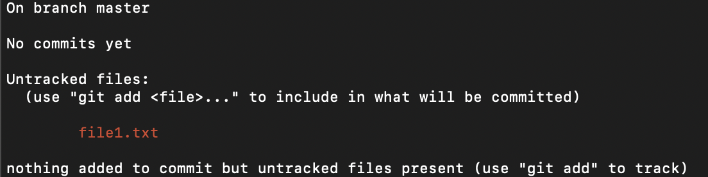
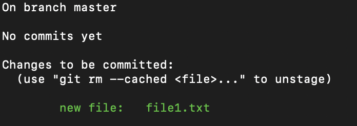

# Before class

  * Install `git`
    * Check if `git` is already installed on your computer by running `git --version` in the command line.
      * If a version of git gets printed out (something like `git version 1.7.7.3`), you're all set!
      * If instead an error pops up (something like `zsh: command not found: git`), install it using either the [Mac installer](https://sourceforge.net/projects/git-osx-installer/) or [Windows](https://git-scm.com/download/win)
  * Create a GitHub account
    * If you don't already have one, [sign up for a free account on Github](https://github.com/join). We'll be using these accounts in class.

# Outline of class agenda

During this class, you will:

* Learn what Git & Github are, and why they're useful
* Set up Git on your computer
* Learn how to make a new repository on Github.com
* Learn how to clone a repository from Github.com to your computer
  * `git clone`
* Use Git for version control
  * `git status`
  * `git add`
  * `git commit`
* Sync your work to the cloud respository with Github
   * `git push`

# Class

Note: this lesson borrows heavily from the Software Carpentry Git Curriculum, all of which can be found free online [here](https://swcarpentry.github.io/git-novice/).

## 1. What are Git and Github?

### Git

Git is a piece of software for implementing something called "version control", which tracks changes you've made to your files, and stores the history of your changes.

Have you ever had a situation like this?


This kind of system, where we have to save a file with a new name everytime we update it (so we don't lose previous work) can be really confusing! Git, by using version control, can make this much simpler.

With Git, you can make your changes and save to just one filename, while still having your change history tracked so you could return to an older version of you'd like. You'll get to try this out soon.

### GitHub


GitHub, on the other hand, is a website that uses `git` to track your files (and your changes to those files) online. This enables you to both a) share your projects (GitHub calls them 'repositories' or 'repos') online for others to see, and b) collaborate on projects and even individual files with other coders. As one example, all the lessons for this course are [stored as a Github repository here](https://github.com/Justice-Through-Code/fall_2020).

By the end of this lesson, you'll also be setting up your own Github repository!

## 2. Making a new Github repo on Github.com

The first step is to make a new repository on Github to sync with the one on your computer. Log into your Github account online, then look for the '+' button near the top right to make a new repo.


Choose 'new repository' from the dropdown menu. You should see the below menu pop up next. Use 'example_git' for the repository name, add whatever description you like, and set it to private. Let's also choose to initalize with a readme file. It will look a little like this one:


After confirming, you'll see your new Github repo. It won't have much in it now -- in fact, just the `README.md` file.

**Note:** this version of the repository on Github.com is stored entirely on the cloud, and is also called 'remote', or 'main'


## 3. Setting up Git on your computer

### *Note: these steps only need to be done once!*

`git` is most often used from the command line (just like how we've been running python scripts), although there are other ways to use it. For the most part, all of the ways we'll use `git` today will be from the command line. When you first set up `git` on your computer, you'll need to do a few extra things to configure it. These are setup steps you have to do **once only**

#### Setting up the git config file

Using the command line, you'll first need to tell `git` what your user name is:

```console
$ git config --global user.name "Paul Bloom"
```

Then, you'll want to set up an email address to associate with your Git activity. Here, you should make sure to use the **same email address attached to your Github account**:

```console
$ git config --global user.email "paul.bloom@columbia.edu"
```

Last, we'll set up VSCode as the default text editor for `git`.
* This means that if git needs to start up a text editor on your computer (we'll talk about this later, but it could happen if you forget a commit message or hit a merge conflict), it will start VSCode by default


```console
$ git config --global core.editor "code --wait"
```

Now you should be all set up to start using Git on your computer!
## 4. Cloning a Github repository to your computer

The repository we set up is on the cloud, on Github.com, but it isn't yet on the hard drive of the computer you are using. To do this, or to connect what is 'local' to this computer, we will 'clone' the remote repository from the cloud. This will literally make a copy of what is on the cloud in a directory on your computer, and you'll be able to access the files via the command line, finder, etc. See more info about cloning [here](https://git-scm.com/book/en/v2/Git-Basics-Getting-a-Git-Repository).

### Make sure you are NOT already in a git repository before cloning!

It is always important to check that you are not already inside a git repository on your computer before cloning. This is because it can be very confusing (and cause a lot of problems with managing files) to have one git repo inside another.

So, to do this, first run:

```console
$ git status
```

If you get a message something like *fatal: not a git repository (or any of the parent directories): .git*
* You are all set! Go ahead and clone, because this is telling you that the folder you are in is not a git repository

If you get **anything** indicating an actual git status,
* **You are in a git repository and should move out of the folder with `cd ..` and check again before cloning**

### Using `git clone`

Now that you've confirmed you are not inside a git repo already, you can go ahead and clone. The syntax of this command is `git clone https://github.com/{your github username}/{name of the repository}.git`

In my case, I ran:

```console
$ git clone https://github.com/pab2163/example_git.git
```

Once you run this, if you run `ls`, you should now see that there is a directory called `example_git` inside your current directory. If you go inside of it, you'll see that the README.md file is in there!

**Note:** Once we have cloned the repo once, we don't need to do it again. We'll come to this later, but future syncs coming from the remote cloud version to the local computer can be done with `git pull`
* think of this as the difference between getting the repo set up on your computer in the first place (`git clone`) and refreshing the contents from the cloud (`git pull`)
* Don't worry too much about this now! We'll talk about `git pull` later

## 5. Using Git for version control

Now that you have a git repository cloned to your computer, there are several git commands (also run from the command line) that will be very useful for managing your repository.

### `git status`

You actually already ran this before, but now that we are in a git repo, this gives us some useful output! Running `git status` tells us what is NEW in the repository since the last commit. This might be confusing, but once we make a commit (keep going if this doesn't make sense), you'll start to see how useful this is.

If we run:

```console
$ git status
```

Now it tells us we are up to date

### Adding (staging) files with `git add`

First, we'll make a text file to start tracking using Git version control. We can make it by using `touch` or from VSCode

```console
$ touch file1.txt
```

You can add whatever text you like to this file. Now, if we run the following:

```console
$ git status
```

You'll see something like this:



This is indicating that while we don't yet have any changes to commit, we do have an untracked file, file1.txt. "Untracked" means git has not yet tracked changes to this file.

So, let's start tracking file1.txt. This is also called 'staging' your changes. Staging tells Git which files we want to capture a version of in our history.

```console
$ git add file1.txt
```

Now, if you run `git status`, you should see something like:



This indicates that file1.txt is now being tracked by Git! It is staged.

### Committing files

Now that you have a tracked file, you can do what is called a 'commit'. This is basically taking a snapshot of *all the staged files at this point in time*, and saving it in the .git file. Crucially, every time we commit, we have to include a commit message (as indicated by the -m flag), which should be a short but useful message describing what changes you've made since the last time.

Here we add the message 'adding file1.txt'

```console
$ git commit -m 'adding file1.txt'
```

Great! Now you've made a snapshot of your work at this point in time! Even as we edit file1.txt in the future, we'll be able to use git to return to this version if we need to.

If you run `git status` again now, you'll see a message like 'On branch main nothing to commit, working tree clean'. This might be surprising, but it actually means that **since the last commit**, there are no new changes.

5. ## Getting the workflow down


For the most part, we run `git add ...` before every `git commit ...`. Why do we need to add before committing?

  * This is helpful when we want to commit changes to some files, but not others. (i.e. we only use `git add` for the specific files we want)
  * Git is not meant for very large files. Being able to stage only some files using `git add ...` means we can leave out large files that might crash Git.


##### So, now let's practice this a few more times:

**A: Updating file1.txt:**

  * Open up file1.txt and make an edit. Run `git status` -- what do you see?
  * Now, *stage* file1.txt. Which command is used to do this?
  * Run `git status` again to check whether you have staged file1.txt. How can you tell whether it is staged or not?
  * Now, *commit* file1.txt. Remember to include a commit message!


**B: Adding script1.py:**

  * Make a new file in your repository called `script1.py`. Put a line or two with the python code of your choice in it.
  * Now, stage script1.py and commit your changes! Use `git status` wherever you like to see if this worked.

**C: Committing multiple changes::**

  * First, make an change to script1.py. Then, make a new file called script2.py. What happens when you run `git status` now?
  * Let's now stage **all** changes. You can do this by running `git add .`   The dot means 'add all files'.
  * Try running `git status` again. Which files have been staged? Why?
  * Now, commit your changes, remembering to include a commit message.


Great! You've now had some practice with the Git workflow. You'll use this same general workflow a LOT throughout the rest of the course when saving version history for your files.


## 6.  `git push`: syncing work back to the cloud


When your repository is synced with Github, you can continue to use `git add` and `git commit` in the same way to store changes on your computer.
* However, up to this point -- these committed changes are not yet on the remote version on Github. To get these there, we will need to *push* them

Then, when you want to push those changes to your online Github repository, you can run:

```console
$ git push
```

This will **push** what's on your local computer to the online repo. Try staging everything, then committing and pushing the changes.

**Note:** If this is your first time pushing, some systems may ask you to enter your username and password to set up a connection to your github account.

## 7. Inspect the changes on github.com

If you refresh the repository webpage for `example_git` on Github.com, you should see your new changes there.

Great! Now you've added the changes you made on your computer to the remote repository in the cloud on Github.com, and learned how to push more changes to Github. In the future, you'll use a similar process for updating other files.

### Viewing your commit history

Right under the green 'Code' button in your repository, click where it says '# commits'. This will take you to a very helpful menu where you can review your commit history. Remember having to write all those pesky commit messages? Now you can see the reason -- this saves a log for you, so each commit message can help you figure out what changes were made there.

Try exploring each of the commits and see if you can figure out how Github highlights what the changes were for each file for each commit.


### Workflows using Github

Now, in addition to `git add`, and `git commit`, we integrate `git push` into our workflow to sync our online repository with work on our local computer. Check out the diagram below for a good schematic of this:


We haven't covered `git pull` and `git checkout` for today, so don't worry about them yet! We will revisit these later in the course when we move to working collaboratively using these tools.

## Examples of existing Github repositories:

There are TONS of Github repositories on the internet for lots of different kinds of projects for software, research, informatics, education, and more. Here is [one list of interesting repositories](https://www.freecodecamp.org/news/the-10-github-repos-people-mention-the-most-in-freecodecamps-main-chat-room-189750600fa4/).

Some additional repos that might be interesting:

  * [A repo for coronavirus data from Johns Hopkins University](https://github.com/CSSEGISandData/COVID-19)
  * [A repo from the Vera Institute of Justice with incarceration data from 1970-2017](https://github.com/vera-institute/incarceration_trends)
  * [A repo for the Spotipy python API](https://github.com/plamere/spotipy) (a way of accessing Spotify data with python)

## Beyond...

There are many more useful things you can do with Github beyond what we've learned today. You can find more info in the [Software Carpentry Git Lesson](https://swcarpentry.github.io/git-novice/), but later on in the course we'll also come back to a few more Git/Github tools, especially for using Github in a collaborative way.
