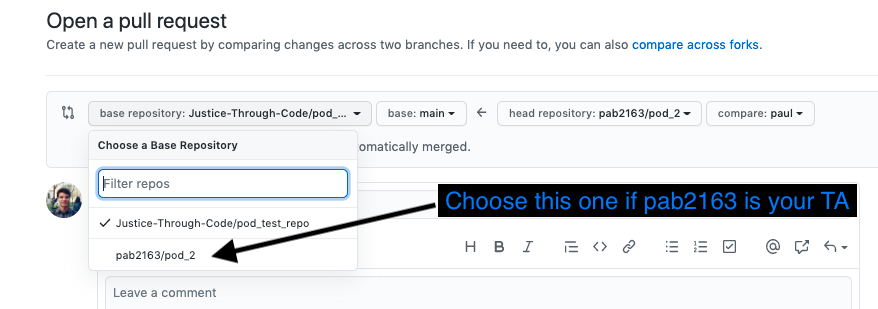

# Class 3 - Active Learning Challenge

In this challenge, you will: 

* Clone your pod GitHub repo
* Create and switch to your own branch
* Customize your README
* Push your changes to GitHub
* Open a pull request on GitHub

## Step 1: Cloning the repository

Just as we did last time, we're going to clone a repository. Your pod TA will send you the link to the repository to clone. There is a green button labeled **Code**. Click this button, and then click on the word **HTTPS** so that it is underlined in orange. Next, click on the clipboard icon next to the URL to copy the URL. 

Next, on the command line, navigate to a directory that is *not* already a GitHub repository. You can verify this by running:
```
$ git status
```
and making sure the response is "fatal: not a git repository (or any of the parent directories)." If you do not get this response, it means you are in an existing git repository. You cannot create one git repository inside another, so if this is the case, use the command
```
$ cd ..
```
to move to the parent directory. Once you're in the parent directory, check the status again to make sure you're not in a repository. Keep doing this until you're not in a repository. 

#### Now, it is **up to you** where to put this Github repository on your computer, but this repository is one that you will use a lot for this class!

So, putting it somewhere you can find easily, such as `/aeshna/Documents/jtc/` might be helpful

Clone your GitHub repository into this folder:
```
$ git clone https://github.com/{your_username}/{repo_name}.git
```
Now, when you list all the files, you'll see a new folder with the same name as your repo. If you list the files in this repository, you'll see a folder called **challenges**, where your TA will push challenges before every class. You'll also see folders named after every student in your pod. Your solutions to the challenges will go inside the folder named after you. 

## Step 2: Creating your branch

Since everyone from your pod will be working on the same repo, we need to separate your work somehow. Git branches are a good way of allowing multiple people to collaborate on the same repository without getting in each other's way or overwriting each other's work. You will create a branch named after yourself with the command:
```
$ git checkout -b {your_first_name}
```
You should see a message that says "Switched to a new branch '{your_first_name}'."

## Step 3: Customizing your README

A repository can have multiple READMEs. For example, let's think of a hypothetical repository called `A`. `A` has a README and a directory called `B`. If we look at the repository on GitHub, we can see that GitHub renders the README. Let's assume there's also a README inside `B`. If we open up `B` on GitHub, we will see the README from `B` is now rendered. For today, we will create a README in your folder.

Move into this folder:
```
$ cd {your_first_name}
```
To make a file named **README.md**, run the command:
```
$ touch README.md
```

If you don't want to use `touch` or are on a machine where this command doesn't work, you can open up the repo in VSCode or Sublime and create your `README.md` file inside your personal folder that way.

Now open up this file in VS Code and add whatever you would like to it. [Here](https://www.markdownguide.org/cheat-sheet/) is the cheat sheet for Markdown. Make sure to save your file once you're done editing it.

## Step 4: Pushing your changes to the repository

After you have customized your `README.md` file, you are ready to push it to the repository you created. 

You can see the content of your repository by checking its status. This command will show you whether each file is untracked, tracked and unstaged, or tracked and staged. Run the command:
```
$  git status
```
You can see that your README is untracked. To track and stage it, run the command:
```
$ git add README.md
```
You can check the status again to see that the file is now tracked and staged. Next, we want to commit the changes to git history. To do so, run the command:
```
$ git commit -m 'Updated {your_first_name}'s README'
```

The last step is to push your changes! Remember, when we're working with branches, we need to push to the correct branch. Run the command:
```
$ git push origin {your_first_name}
```

## Step 5: Opening a PR in GitHub

On GitHub, you can now see that there are more branches created. If you click on the drop down menu that says "Main", you can see all the other branches (yours and your peers'). Now, to open a pull request, let's click on **Pull Requests** on the top menu of the repository (the other options in this menu are Code, Issues, etc). Click the green button that says **New Pull Request**. 

You should see that Github checks quickly, then tells you that your changes can be automatically merged. 

### Make sure you submit your pull request to your pod's repo!


Once you open the pull request, there is something very important to check! You want to make sure you will be sending your pull request to the repo for your pod, not the more general JTC repo. So, you'll want to make sure that in the option on the left where you are asked to 'Choose a base repository', **you want to choose the repository that is linked to your TAs account and is labeled for your pod. Do not choose the one linked to the Justice-Through-Code account.**





Once you have confirmed that you have selected the correct base repository,  you are all set! On the next page, press the green button that says **Create Pull Request**. On the next page, name your pull request something meaningful and add your pod TA as a reviewer on the right hand side. Last, press the green button that says **Create Pull Request**. You have now opened a pull request! You can take a look at the other branches and PRs to get a sense of how GitHub collaboration works. 

Now that you've done this, talk to your TA and watch what they do when they see the pull request you have submitted.

Congrats on finishing this challenge! You are officially a Github collaborator now!

