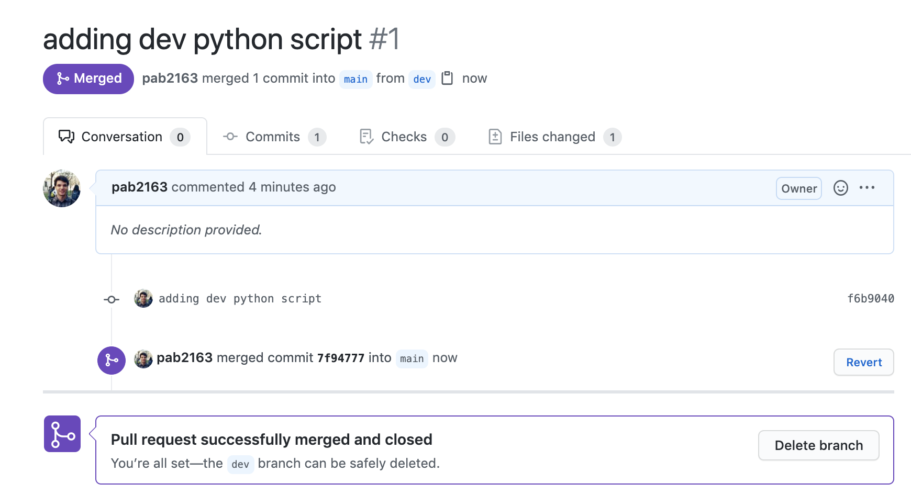

# Before class

* Make sure you feel comfortable doing the following
  * Making a repo on Github.com
  * Cloning a repo from Github.com to your local computer
  * Using `git status`, `git add`, `git commit` and `git push`
  * Examining commit history and diffs on Github.com

# Outline of class agenda

During this class, you will:

* Learn why Github is so useful for collaboration
* Get comfortable using `git pull` regularly to get information from the cloud repo to your computer
* Get comfortable with making and using branches
* Get comfortable with submitting pull requests
* Learn about how teams can use pull requests for collaboration

# Class 

## 1. Why Github for collaboration?

Git is a great too for collaboration! Here are a few reasons why:
* Version control means that you & collaborators won't have to duplicate files and have many versions of them as you are working
* Everyone can see the common history of commits to files -- this makes it easy to fix mistakes and see who updated which files when
* The cloud repo also serves as a cloud backup for all your files, and the fact that file histories are saved helps protect you from losing anything important
* Public Github repos are a great way to share open source code, and this can spur collaborations between people who might not otherwise work together


### Adding collaborators to a repo

Anyone can clone a public repo, but if you want to have collaborators who can push directly to your repo, you will have to add them. You can do this by clicking on 'Settings', then 'Manage Access' on your Github repo. Then, you can search and add collaborators by their usernames. They should get emails with invitations, and will be able to push to the repo once they accept. 


**Note:** *you probably only would want to do this for trusted collaborators who you'd like to give access to the particular repo*

## 2. The flow: `git pull` before you start making changes

When collaborating, it is important to always 'pull before you work'. 
* Why? Because this ensures you are up to date with the cloud version
* If you're collaborating and someone else has made changes you should know about, this will keep you updated with those changes


### Pulling when you are up to date already
So, if we go into our `example_git` repo from last time on our local computer, and run `git pull`, we likely see something like this:

```console
(base) Pauls-MacBook-Pro:example_git paul$ git pull
Already up to date.
```

Here, git is letting you know that you're already up to date -- i.e. no changes from the remote since you last worked on it.

### Pulling when changes have been made on the remote

In this example, I'll go to the remote `example_git` repo on Github.com and make a few update (for example, I could edit the `README.md` file)

Now, when I run `git pull` from my command line, I get:

```console
(base) Pauls-MacBook-Pro:example_git paul$ git pull
remote: Enumerating objects: 5, done.
remote: Counting objects: 100% (5/5), done.
remote: Compressing objects: 100% (3/3), done.
remote: Total 3 (delta 0), reused 0 (delta 0), pack-reused 0
Unpacking objects: 100% (3/3), done.
From https://github.com/pab2163/example_git
   d7a0af1..99fad53  main       -> origin/main
Updating d7a0af1..99fad53
Fast-forward
 README.md | 3 ++-
 1 file changed, 2 insertions(+), 1 deletion(-)
 ```

 We don't have to go too in detail into what all of this means, but these are all details showing how git has *pulled* the files from the remote to update the repo. Now, if you check your local repo, the changes should match what you did on the cloud remote.

Remember, it's good practice to **always pull** before you start working on files to make sure you're up to date!

## 3. Making a new branch with `git checkout -b [new branch]`

Let's say you have some working software, but you want to add another feature. If you have your code on Github, you can do something called creating a *branch* so that you can work with a parallel version of the code for the new feature you are developing while keeping the *main* version of the code intact. Then, once you make sure the developmental version works properly, you can *merge* it back to the main version of your code to add it in. 

This is the essence of branches in git! The main goal is to have multiple versions of your code at the same time, so you can develop while maintaing a central 'main' version. 

**Note::** typically the central branch of the repository is called `main`

See below for a few useful diagrams of some possible branching. 


With these diagrams, you can think of the dots as individual commits. 


### Making a new branch

To create a new branch and go to that branch, you can run the following code

```console
$ git checkout -b dev
```

This will create a new branch called `dev` (short for 'development' I suppose) and you will now be on that branch. 

```console
(base) Pauls-MacBook-Pro:example_git paul$ git checkout -b dev
Switched to a new branch 'dev'
```

### Working on a new branch

Once you are on a new branch, you can work with the files, and run `git add`, `git status`, and `git commit` as you normally would. So here, I'll add a new file called `dev_script.py` to the repo. 

```console
(base) Pauls-MacBook-Pro:example_git paul$ touch dev_script.py
(base) Pauls-MacBook-Pro:example_git paul$ git add dev_script.py 
(base) Pauls-MacBook-Pro:example_git paul$ git status
On branch dev
Changes to be committed:
  (use "git reset HEAD <file>..." to unstage)

	new file:   dev_script.py

(base) Pauls-MacBook-Pro:example_git paul$ git commit -m 'adding dev python script'
[dev f6b9040] adding dev python script
 1 file changed, 0 insertions(+), 0 deletions(-)
 create mode 100644 dev_script.py
```

However, when it comes time to push, we have to do something a little different.

### Pushing with branches

Now that we have multiple branches, we have to specificy which one to push to, when we run `git push`. This is called 'setting the upstream branch' (with upstream being the cloud remote repo) 

This always follows the syntax `git push --set-upstream origin [branch name]`, where we specify which branch to push to on 'origin' (the remote)

So here, we'll push to dev:

```console
(base) Pauls-MacBook-Pro:example_git paul$ git push --set-upstream origin dev
Enumerating objects: 4, done.
Counting objects: 100% (4/4), done.
Delta compression using up to 8 threads
Compressing objects: 100% (2/2), done.
Writing objects: 100% (3/3), 286 bytes | 286.00 KiB/s, done.
Total 3 (delta 1), reused 0 (delta 0)
remote: Resolving deltas: 100% (1/1), completed with 1 local object.
remote: 
remote: Create a pull request for 'dev' on GitHub by visiting:
remote:      https://github.com/pab2163/example_git/pull/new/dev
remote: 
To https://github.com/pab2163/example_git.git
 * [new branch]      dev -> dev
Branch 'dev' set up to track remote branch 'dev' from 'origin'.
```

Now, we can see that our updates have been pushed to the `dev` branch on the remote. But, where *is* that branch on the remote?

## 4. Seeing branches on the remote

If we now go to Github.com, we can now see that the repo is showing a banner about our new branch! It is automatically telling us that there were recent pushes.


Also, right under that (on the left side), we can see that there are now 2 branches, if we click on this, we'll be able to see that we now have both `main` and our new one, `dev`


Here, you can switch back and forth by clicking on which branch you want to go to. You'll notice that you ONLY will see your new changes on the `dev` branch that you pushed to, but not `main`. This is how we have a 'developmental' version at the same time as the main one.

## 5. Viewing and switching branches from the command line

When we go back to the terminal, lets say we want to check which branch we are on.

We can run `git branch` to see -- it will show a little start next to the current branch

```console
(base) Pauls-MacBook-Pro:example_git paul$ git branch
* dev
  main
```

So we can see we are on dev.

We can also run `git show-branch -a` to see a schematic of commits to each of the active branches:

```console
(base) Pauls-MacBook-Pro:example_git paul$ git show-branch -a
* [dev] adding dev python script
 ! [main] readme update
  ! [origin/HEAD] readme update
   ! [origin/dev] adding dev python script
    ! [origin/main] readme update
-----
*  +  [dev] adding dev python script
*++++ [main] readme update
```
### Switching branches with `git checkout 

Maybe we'd like to go back to the `main` branch now, if our work on `dev` is done for now. We can switch to any *existing* branch with the syntax `git checkout [branch name]`.

So let's go tback to `main`:

```console
(base) Pauls-MacBook-Pro:example_git paul$ git checkout main
Switched to branch 'main'
Your branch is up to date with 'origin/main'.
```

Now we can see we are back on `main`, and we are up to date! 

## 6. Pull requests

Now we are at the stage where our `dev` branch has content we think is all set, so we want to bring it back into `main`! To do this we will set up a *pull request*, which is a request that the updates from one branch be pulled into another. In this case, we want to pull from `dev` into `main`. 
* Why the 'request'? Pull requests are often a form of implementing code review/moderation. So, one team member will submit a pull request, then another person will review it and decide whether to approve. 
* As we go forward in the challenge and the class, you'll get used to this workflow for collaboration. 
* In general, when working in teams, it is good practice for most updates to be sent to other team members for review as a pull request (rather than just pushing straight to `main`). Pushing straight to main is a bit like making a change to a project without asking anyone else's approval -- in some situations it might be an okay choice, and in others, definitely not. 

### Opening a pull request

So, on Github we can see that there is an option to open a new pull request for the `dev` branch


We can click 'New pull request' for the dev branch.


Once this window pops up, there are a few things to know about a pull request:
* In the top bar, you'll see which branch is being merged into the other, and whether the branches can be automatically merged or not. Usually, this should be the case! The one on the left (`base: main`) is the one we are merging the one on the right (`compare:dev`) into. 
* Just like commit messages, pull requests should have a nice short descriptive message -- to help you and your team out!
  * However, there is room to leave more detailed comments below. Often this can be useful if there are specific things you'd like your team members to look at
  * In your longer comments - you can put code snippets, references to links, checklists, etc

Once you are ready, click 'Create pull request'

## 7. Reviewing pull requests (PRs)

If a pull request has just been submitted, it is NOT yet merged to the destination. Remember, it is a *request*! Now, the request needs to be **reviewed** before it can be **merged**. The **merge** is what will pull the changes from `dev` to `main`.

So, once it is submitted, you'll see a window like this. Hopefully, you should see that 'This branch has no conflicts with the base branch'. If not, merging may require some more planning ahead...we'll get to this later. 


Typically, once this happens, another team member will review the commits and changes, then click 'Merge pull request' when they approve. If they do not approve yet, they can add comments or requests for changes before it will be merged. 

Once someone has merged, you'll see the pull request turn purple to indicate that the pull request has now been 'merged' with the main. 



If you want at this point, you can delete the branch.
* In general it is good practice not to have too many branches floating around.
* However, if you're going to work more on this `dev` branch soon, it might make sense to keep it open and makemore commits to it.


## 8. Pull requests & collaboration flow

Each group has different standards and practices for how to submit pull requests and review them:
* Some teams require that certain users review all pull requests
* Other teams let users assign reviewers specifically to pull requests
* Some projects also have automated checks and code tests that are automatically triggered when a PR is submitted, and the team will wait to make sure that the code passes all the tests before merging

Congratulations on your first merged pull request! Now, you are ready to continue exploring and using Github for team collaboration!