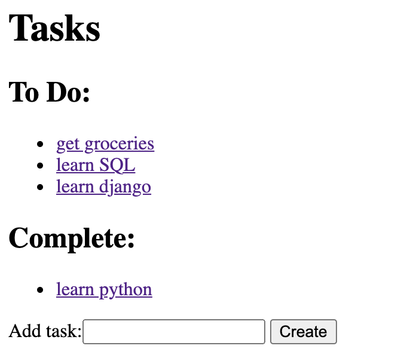
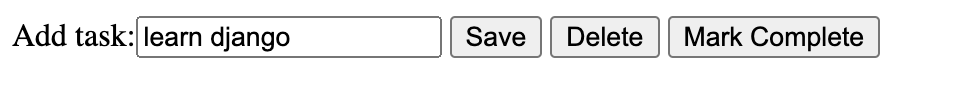
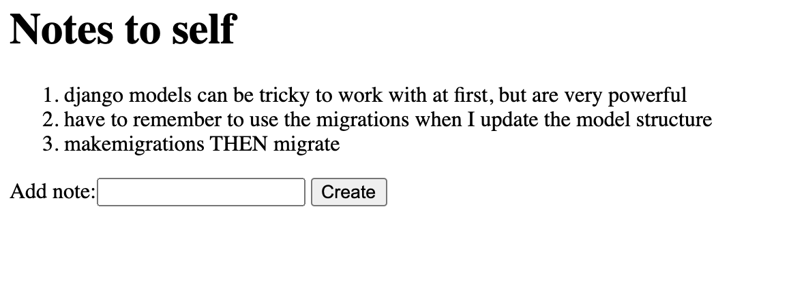

# To-do list app: django challenge

In this challenge, you'll build on the Django to-do list app demonstrated in today's lesson to add a few more features! 

## Challenge steps

### Setup
1. Download [this zip file](https://courseworks2.columbia.edu/courses/152667/files/folder/django_templates) from Canvas containing the `todoproject.zip`. This is the code demonstrated during class today. 
    * Unzip the file and make sure to put the whole folder into the `django_projects` folder
2. Make sure you have activated your virtual environment for django

### Create a system to mark tasks as complete
3. Make a new attribute called `completed` in the `Task` model that can take the Boolean values `True` or `False`. *Hint:* reference the [django model field documentation](https://docs.djangoproject.com/en/3.2/ref/models/fields/) for a solution on how to implement this.
    * Task items should have `completed` as `False` when they are initialized by default 

4. Update the homepage for the todo list app (`http://127.0.0.1:8000/todo/`) so that tasks are organized into two separate lists, marked as *"To Do"* and *"Complete"*. It should look something like this:

5. Update the details template for individual tasks so that there is now a form option to mark the task as complete (i.e. through using a button) in addition to saving or deleting the task. It could look something like this. 
    * Make sure that when you mark a task complete on this page, you are returned to the homepage, and the completed task is now listed as complete!

### Make a new page & model for notes!

Now we'll make a way for users to keep a list of notes. This will be structured quite similarly to the todo-list part of the page, and will be practice in creating a whole new model 

6. Create a new model called `Note` similar to `Task`, that has 1 attribute, `text`. 

7. Create a notes page at `http://127.0.0.1:8000/todo/notes` that looks similar to below. It should have the following features
    * Display notes added by the users from oldest (top) to newest (bottom) in an ordered list
    * Have a form where a user can create a new note, which can be added to the list. Make sure the new note you add appears at the bottom of the list!

8. Link your notes & todo pages together in a user-friendly way! Make hyperlinks at the bottom of each page that take you to the other page
    * So it is easy for a user to get from the to-do list to the notes and vice-versa, even if you don't know the exact URL

## Nice work! Commit your work, push, and send a pull request for your TA to review! 

Nice job, you finished the challenge!
