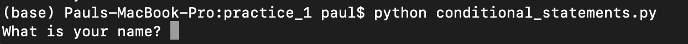
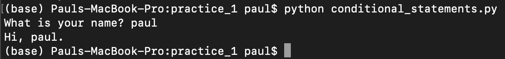

# Bootcamp class 6 - Logic


# Before class

* Make sure you're familiar with all 4 primitive data types (integers, strings, floats, and booleans)
* Refresh yourself on how to *convert* between the four basic data types
* Refresh yourself on how to *determine what type* a variable is

# Outline of class agenda

Today we'll learn about **logic** in python. By the end of the lesson, you'll:

1. Understand what [**logical operators are**](https://realpython.com/python-operators-expressions/) and feel comfortable using them to test whether conditions are true or not
    * Get comfortable with using double equals signs (`==`)
    * Use `True`/`False` logic with all primitive data types
2. Combine logical operations into compound statements with `and`, `or`, and `not`
3. Feel comfortable with [**conditional statements**](https://realpython.com/python-conditional-statements/), and be able to use them to control how code runs
    * Use `if`,`elif`, and `else` to control code flow
    * Get comfy with syntax for conditional statements (colons, indenting)
    * Get some experience with nested conditional statements
    * Using conditional statements with user input


## 1. Logical Operators

**What is logic in python?**
* There is really only one question that logic answers, *True or False?*
* Every single logical operation in python gives us an output of either `True` or `False` as a Boolean variable.
* We can use this logic to *test* things in python, and have our code depend on these `True` or `False` answers.

### Numeric logic (math comparisons)

Math might be the most intuitive place to start learning logic. In python, we can ask whether certain **comparisons** of strings and floats are true or not.

For example, this code asks whether `1` is greater than `0`
```python
print(1 > 0)
```

For this integer comparison we get the output
```console
True
```

There are several sets of **comparison operators** like these we can use to compare numbers:


To continue our box metaphor with variables (variable names refer to boxes, which store the variable contents inside), we can think of logical comparisons as 'picking up different boxes and comparing their contents'. Let's try some out and see:

```python
a = 0
b = 1
c = 1

print(f'is a equal to b?: {a==b}')
print(f'is a not equal to b?: {a!=b}')
print(f'is a greater than b?: {a>b}')
print(f'is a less than b?: {a<b}')
print(f'is b greater than or equal to c?: {b>=c}')
print(f'is b greater less or equal to c?: {b<=c}')
```
We get a Boolean `True` or `False` for each condition:
```console
is a equal to b?: False
is a not equal to b?: True
is a greater than b?: False
is a less than b?: True
is b greater than or equal to c?: True
is b greater less or equal to c?: True
```

One thing to mention here is that the number of spaces before/after the double equals sign don't *really* matter, as long as the code is on the same line and easy to read. Good to stay consistent though.

### Equals signs (`=` vs. `==`)

You might be wondering about the double equals sign here. That's normal! This can be very confusing at first, but in python we ALWAYS use **a single equals sign for variable assignment** and **double equals signs to compare whether two variables are equal**.

So if we do something like this:

```python
a = 2
```

This is assigning the value of `2` to the variable named `a`. But if we do:

```python
print(a == 2)
```

This will evaluate whether the variable `a` stores a quantity equal to 2. (i.e. we are 'checking inside the box' to see whether 2 is in there). The return will either be the answer `True` or `False`.

### Comparing integers and floats with another

One important thing to know about logic with numeric data types (integers and floats), is that mathematical properties are obeyed. So, an integer and a float with the same mathematical value will be found equal:

```python
print(3 == 3.00000)
```

This gives:

```console
True
```

So, even though integers and floats represent the data differently under the hood, python knows they have the same value for making math comparisons in this situation.


### Logic with Boolean variables

When it comes to logic in python, Boolean variables can be used mathematically such that:
* `True` is equal to `1`
* `False` is equal to `0`

We can check this by running

```python
print(True == 1)
print(True == 1.0000)
print(True == 0)
print(True > 0)
print(False == 0)
```

So we get
```console
True
True
False
True
True
```

Each of these help us see that `True` is equivalent to the value 1 and `False` is equivalent to the value 0. In fact if we run the code:
```python
print(3.5 + True)
```
We get:
```
4.5
```

Just as if we had added two numbers together.

**However, Boolean variables are NOT equal to strings with the same spelling:**
```python
print(True == 'True')
```
Gives us:
```console
False
```

So, in summary, we can see that booleans can be treated mathematically and compared with floats and integers, but they are not so directly comprable with string data.

### String Logic

**Technically**, we can use ALL of the same logic in comparing strings as with integers, floats, and boolean data types. For example, we can check if two strings are equal to one another and see that case matters:

```python
# make some string variables
a = 'cat'
b = 'cat'
c = 'CAT'

# check if they're equal to one another
print(a == b)
print(a == c)
print(a != c)
```
So here, we get:
```console
True
False
True
```

The string variables that have *exactly the same sequence of characters* are equal to one another, otherwise not. And, we can see that **python is case-sensitive**, so the case must match exactly for strings to be considered equal. **But**, things get a little tricky when we try to see whether one string is 'greater' than or 'less' than another. For example:

```python
print('cat' > 'bat')
```

This code evaluates to:
```console
True
```
Weird! Why?
* Under the hood, python stores values for every single possible text character using a system called [Unicode](https://docs.python.org/3/howto/unicode.html). We won't go into this here, but python can compare the unicode values for any two characters or strings, and return `True` `False` based on this. For this reason, unless we are **really** sure we know what we want and how to do it, using `>` or `<` to compare strings may not be the most effective.
* Comparing strings to integers/floats/booleans can be odd too for the same reasons. For example:

```python
print(2 == '2')
print(2 == '2.0')
```

Gives:

```console
False
False
```

For the most part, comparing strings to numeric data this way doesn't serve too many uses.

## 2. Compound Logic (`or`, `and`, & `not`)

So far, all the logic we've worked with has been based on a single comparison. But, we can put them together to make 'compound conditional' operations. Luckily, python gives use a way to do this with fairly user-friendly language.

### `or`

With `or`, we can combine two conditions, and we will get `True` if **at least one (or both) is true**. For example:

```python
print(2 < 3 or 4 < 3) # only the first is true here
print(2 > 3 or 4 > 3) # only the second is true here
print(2 > 3 or 4 < 3) # neither are true here
print(2 < 3 or 4 > 3) # both are true here
```
Here we get:
```console
True
True
False
True
```
So, we get true for each of these *except* for the third one, when neither piece is True

### `and`

With `and`, we get `True` **only if both conditions are true**. So, if we repeat the same code as the previous piece but with `and`:

```python
print(2 < 3 and 4 < 3) # only the first is true here
print(2 > 3 and 4 > 3) # only the second is true here
print(2 > 3 and 4 < 3) # neither are true here
print(2 < 3 and 4 > 3) # both are true here
```

Only the last one where both are true returns `True`:

```console
False
False
False
True
```

We would also see the same results by plugging in boolean variables themselves:
```python
print(True and False) # only the first is true here
print(False and True) # only the second is true here
print(False and False) # neither are true here
print(True and True) # both are true here
```

### `not`

With `not`, this **reverses** whatever existing logical operation exists. For example
```python
print(not 2 > 3)
print(not False)
print(not True)
```
This outputs:
```console
True
True
False
```
So, the first two statements are `True`, because the `not` reverses conditions that are not met. The last one reverses `True`, giving `False`.

#### Combining `and` and `not`

We can combine these two statements like so:

```python
a = 1
b = 2
print(a < 10 and not a > b)
```

So, this will print `True` only if the first condition is met and the second one isn't.

## 3. Conditional Statements

So far with logic, we've learned a lot about how to get `True` or `False` answers. But, *why is this useful?*

Logic can be really useful because we can use if for **conditional statements**, or in other words, code that *does something different based on whether a condition is `True` or `False`.


### `if` statements

Luckily, conditional statements have a syntax in python that is pretty close to the English language. If we want to run code that **only does something if a condition is true**, we can use an `if` statement. Here's an example (pay attention to what happens after you type the colon and hit enter!):

```python
# assign a to be equal to 5
a = 5
if a > 3:
    print('greater than 3!')
```

So if we run this, we get:
```console
greater than 3!
```
Because a is equal to 5, which is greater than 3. The statement was true, so the next line of code ran. In general, **all** if statements follow this syntax. Namely, we have a first line with a logical statement (`if`...) followed by a colon. Then, all code indented (i.e. with a tab) following this *only* will run if the statement evaluates to `True`

So, for example, if it isn't true:

```python
a = 2
if a > 3:
    print('greater than 3!')
```

When we run this we get no output. Why? Because we haven't yet given python any instructions of what to do if the condition isn't met.

### `else`

`else` is what we can use to tell python what to do if a condition is not met! So, if we return to the previous example, we can add an `else` statement below:

```python
a = 2
if a > 3:
    print('greater than 3!')
else:
    print('less than or equal to 3!')
```

When we run this code, we get:
```console
less than or equal to 3!
```

Why? Because the initial `if` statement evaluates to `False`, so the indented code following the `else` statement is run instead. Importantly, we can have multiple lines of code inside these conditional statements, like so:

```python
a = 2
if a > 3:
    print(a)
    print('greater than 3!')
else:
    print(a)
    print('less than or equal to 3!')
```
So when we run this code, we get:

```console
2
less than or equal to 3!
```

This is because all the code inside the indented `if` statement is being run.

### `elif`

The third key conditional statement to know is `elif`, which stands for 'else if'. This one is statement that is very simlar to `else`, but instead of *automatically running* if the previous condition isn't met (as `else` does), it comes with a **logical statement of its own that must be met for it to execute**. Let's try it out

```python
a = 2
if a < 0:
    print('a negative number')
elif a > 0:
    print('a positive number')
```
When we run this code, we get:
```console
a positive number
```
This is because a is 2, so the initial `if` is False -- this code doesn't run. Then the `elif` statement checks to see whether a is greater than 0. Because this is True, it prints 'a positive number'.

But, so far, this is working pretty much the same way as if we had used an `else` statement. We can see the difference, though, if we set a to 0 so that *neither* statement is True.

```python
a = 0
if a < 0:
    print('a negative number')
elif a > 0:
    print('a positive number')
```
When we run this code, we get *no output*, because neither statement evaluates as `True`. Why is this useful? Because with `elif` statements, we can test a series of conditions beyond just one binary decision. For example, this code prints out somethign different depending on which season it is:

```python
season = 'fall'
if season == 'spring':
    print('getting warmer')
elif season == 'winter':
    print('cold out')
elif season == 'summer':
    print('hot out')
elif season == 'fall':
    print('getting colder')
```
If we assign season to be fall, then we get the output:
```console
getting colder
```
So, this very neatly tested several conditions for us. Great!

Now, we *could* make the last one an else statement, and for this example it would do the same thing. However, it might also cause some problems. Let's say the season is 'winter', but we used a capital letter:

```python
season = 'Winter'
if season == 'spring':
    print('getting warmer')
elif season == 'winter':
    print('cold out')
elif season == 'summer':
    print('hot out')
else:
    print('getting colder')
```
This still prints out:
```console
getting colder
```
This is because the code is doing everything we asked it to -- none of the first 3 conditions evaluate to `True`, so it prints out the message we meant for fall.

#### Multiple `if` statements

You might wonder what happens if we do multiple `if`s in a row. What happens here is that **each one will be checked to see if they are true, no matter what happens on the previous ones**. So, multiple if statements make sense if we don't want what happens at one part to depend on the next.

```python
a = 2
b = 30
if a > 10:
    print('a greater than 10')
if b > 10:
    print('b greater than 10')
```

So when we run this we get:
```console
b greater than 10
```

It doesn't matter what a was - the second `if` statement still runs

### Conditional statement syntax: colons + indents

**Why the colons and indents?**
* This [system of indents after conditional statements](https://www.w3schools.com/python/gloss_python_indentation.asp) might seem confusing at first, but it is one way that python helps to organize code
* Eventually, you'll learn to read indents intuitively to see *which code depends on which other pieces*. This can be super helpful for longer pieces of code especially
* Soon, we'll learn that colons can be used in several other ways to control 'code flow'

### Nested conditions

One useful thing is that we can 'nest' conditional logic, such that we can have conditional statements that themselves are only run if another condition is true. For example:

```python
a = 10
if a > 0:
    print('a is positive')

    # a second level of nested logic
    if a > 10:
        print('a is greater than 10')
    else:
        print('a is not greater than 10')
```
When we run this code, we get:
```console
a is positive
a is not greater than 10
```
This is because the first statement was true (a > 0), so python ran the second `if` statement to check whether it was greater than 10.

We won't spend a lot of time with nested conditions now, but this concept of 'nesting' is one that we'll come back to for several uses later on.

### Conditional statements with user input

We can use the `input()` function in python to ask the user a question, then save their input. For example:

```python
name=input('What is your name? ')
print(f'Hi, {name}.')
```
If we run this code in a script from the command line, we get something like this with the cursor flashing. It is now 'waiting' for us to enter our input. We can do this by typing the input, then pressing `enter`



So, then once you (the 'user') enter your input, that input will be assigned to the variable `name`, then printed out in the next line!



**So, we can now combine getting user input with conditional statements!**

Try this:

```python
# ask the user if they want to hear a joke
answer = input("Do you want to hear a joke? (press y / n) ")

# code responds accordingly
if answer == "y":
    print("I'm against picketing, but I don't know how to show it.")
    # Mitch Hedberg (RIP)
elif answer == "n":
    print("Fine.")
else:
    print("I don't understand.")
```

Try running this in a script, and try giving the responses 'y', 'n', or something else, and see how the code responds.


Pretty cool right? Now we're starting to see how powerful python / coding can be for handling user input and starting to **automate** processes on the 'back end'. A lot of this type of logic is used for apps and websites that handle user interaction, using a combination of python and other languages.

# Overview of what we learned today

* Logical operators -- how to compare variables in python and assess if conditions are true or not
* The difference between a single and a double equals sign in python
* How to use logic with the 4 primitive data types
* Compound logic using `and`, `or`, and `not`
* How to use the conditional statements `if`, `else`, and `elif`
* How to get user input, and to use this with conditional statements


All of these things are VERY powerful tools, especially once we combine them with new data types -- coming soon!
