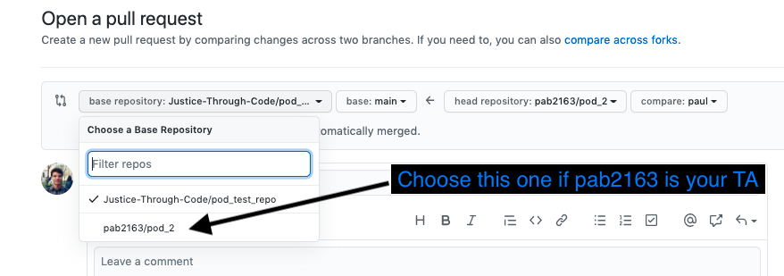

# Lists Challenge: Top 100 Highest Grossing Movies at the Box Office (1999)

## Challenge

In this challenge, we're giving you a script called `box_office_challenge.py` that you'll be working on to manage the list of the Top 100 Highest Grossing Movies at the Box Office from 1999. This year included classics like The Matrix, Fight Club, Sixth Sense and many others.

To get started, pull the repository, and copy the `box_office_challenge.py` script from the challenges folder into your personal folder (ie using `cp` from the command line). You can use `ls` inside your personal folder to make sure the `box_office_challenge.py` script is really in there!

## Complete the challenge according to the instructions in the script

Don't forget to comment your code!

## When you finish, push to your changes to your personal branch of your pod repo, and submit a PR!
*   **Remember:** when you set up the pull request on github, make sure the 'base repository' is the one set up by your TA for your pod, NOT the one called `Justice-Through-Code/pod_test_repo`

