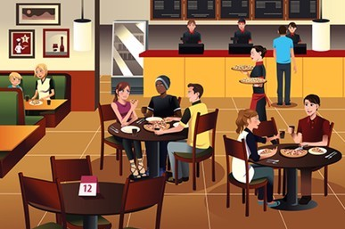

# Dictionaries

In this challenge, we are providing you with a file - `restaurants_challenge.py`. You will be working on this file to play with some Python dictionaries.

## Challenge



## Overview of the challenge

In this challenge, you will be creating dictionaries, reading data from nested dictionaries and also perform add, update and delete operations on dictionaries, specifically revolving around restaurants.

### Pair Programming

Today you'lll be working in *pairs*, rather than with your pod. Your partner might be in a different pod from you. 


To get started, put the `restaurants_challenge.py` script into your personal folder inside your pod repo. Then, open up the script and complete the challenge from there!

At some point, make a comment at the top of the script indicating the date and the script authors, for example:

```python
# Authors: Mia Jackson & Kevin Harper
# Date: 2/2/2021
```

## Push to your personal branch in your pod repo

Both people in your pair should make sure to add the completed work to their branches of their respective pod repos
